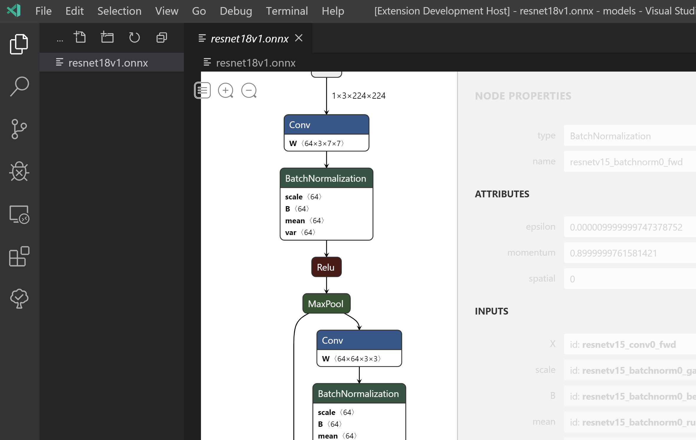

# vscode-netron

This is an experimental tech demo showcasing Netron machine learning model visualisation inside VS Code using the new [custom editor](https://github.com/microsoft/vscode/issues/82115) proposed API. Simply download a model, for example from https://github.com/onnx/models, and click on it. For comparison purposes to the existing VS Code API, the Netron preview is also exposed by right-clicking on a file and selecting "Open file with Netron".

This demo is based directly on Netron's web hosted version: https://lutzroeder.github.io/netron/.

## Caveats

- Styling of the properties panel on the right is a bit messed up, likely due to VS Code's injected CSS styles. Someone would have to dig deeper to figure out how to fix it.
- Netron's JavaScript is used as-is from https://lutzroeder.github.io/netron/ and lightly monkey-patched (see index.html) to work inside VS Code's webview environment. Netron should be made more flexible to avoid any monkey-patching.
- Ideally, Netron's js files should be hosted locally inside the extension, however that would require more work to deal with VS Code's webview restrictions when loading css/js files from disk.
- Model files can be quite big, and since all decoding/loading of the model happens in JavaScript using the original Netron code it is likely not well suited for use in VS Code's remote development via SSH since the model has to be downloaded from the remote machine to the local host first. To avoid this, Netron would have to be split up to support a server/client scenario where one half runs in Node.js on the remote machine (model loading, extracting necessary metadata, sending array data on-demand when requested by the user) and the other half running in the browser and dealing with UI only. See https://github.com/lutzroeder/netron/issues/348.
